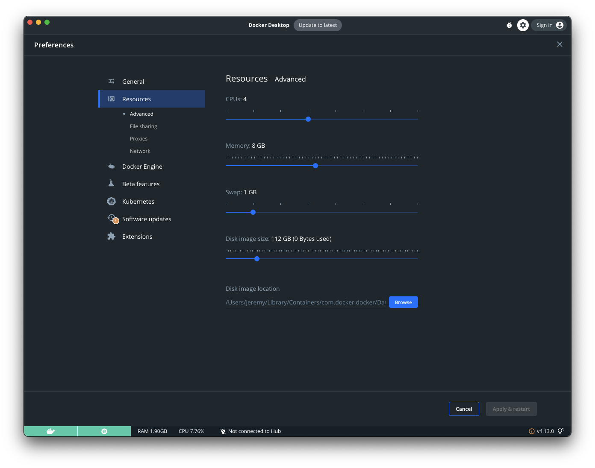

## dbt-performance

dbt benchmarking and stuff.

### System specs

```
$ system_profiler SPHardwareDataType

Hardware:

    Hardware Overview:

      Model Name: MacBook Pro
      Model Identifier: MacBookPro16,2
      Processor Name: Quad-Core Intel Core i5
      Processor Speed: 2 GHz
      Number of Processors: 1
      Total Number of Cores: 4
      L2 Cache: 1 MB
      L3 Cache: 3 MB
      Hyper-Threading Technology: Enabled
      Memory: 16 GB
      System Firmware Version: 1715.60.5.0.0 (iBridge: 19.16.10647.0.0,0)
      OS Loader Version: 540.60.2~89
      Activation Lock Status: Disabled
```


